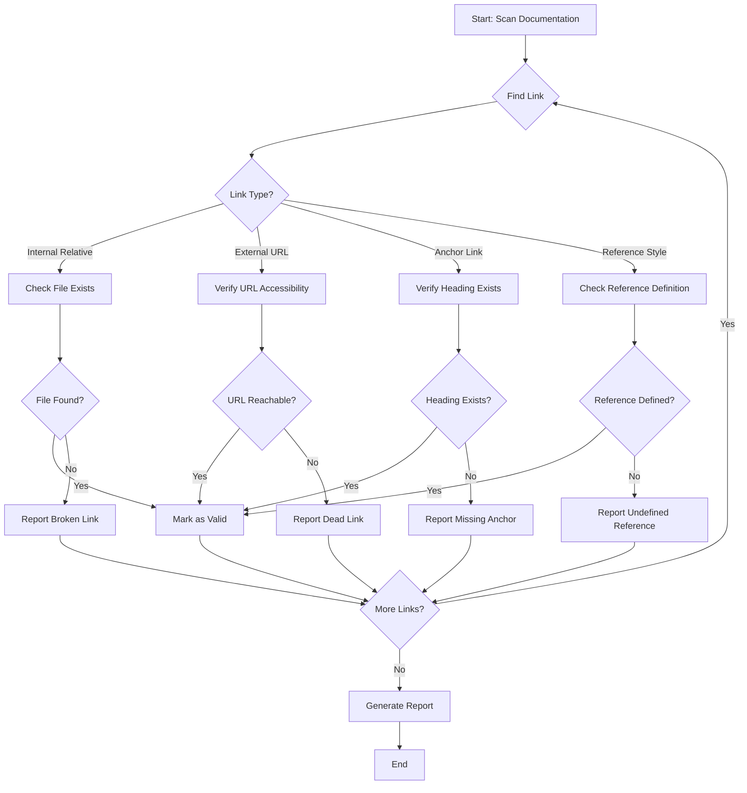
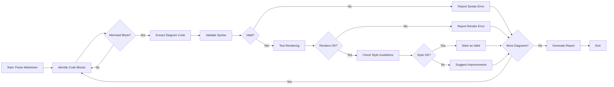
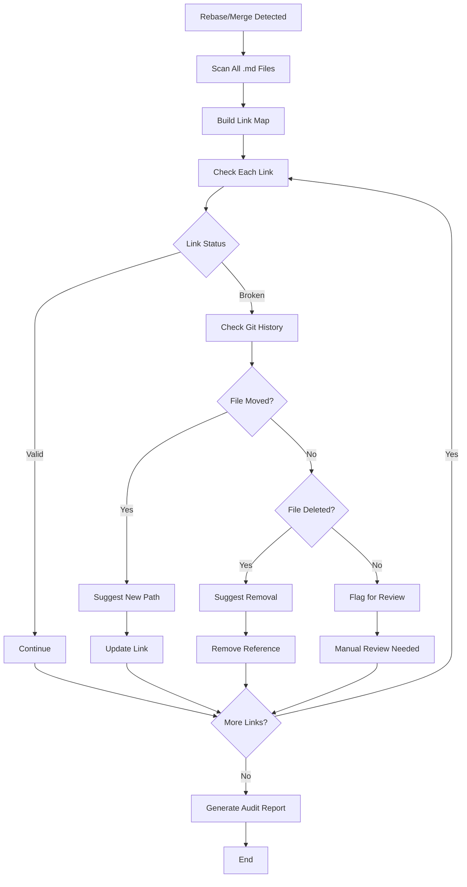

---
# Fill in the fields below to create a basic custom agent for your repository.
# The Copilot CLI can be used for local testing: https://gh.io/customagents/cli
# To make this agent available, merge this file into the default repository branch.
# For format details, see: https://gh.io/customagents/config

name: Markdown Integration & Testing Agent
description: Specialized agent for validating markdown documentation, verifying cross-reference links, and ensuring diagram rendering integrity in the Nexus Wallet Interface repository.
---

# Markdown Integration & Testing Agent (mIt)

The **mIt agent** is a specialized custom agent designed to maintain the quality and integrity of markdown documentation within the Nexus Wallet Interface repository. It focuses on three primary areas: link verification, diagram validation, and documentation consistency.

## Agent Capabilities

### 1. Link Verification
The mIt agent verifies all types of links found in markdown documentation:

- **Internal relative links** - Links to other markdown files or source files within the repository (e.g., `[Guide](./docs/README.md)`)
- **External URLs** - HTTP/HTTPS links to external resources (e.g., GitHub, npm, Electron docs)
- **Anchor links** - Links to specific headings within documents (e.g., `[Section](#heading-name)`)
- **Reference-style links** - Numbered references used in auto-generated documentation
- **Email links** - Contact addresses in documentation

### 2. Diagram Rendering & Validation
The agent ensures that Mermaid diagrams and other visual documentation elements:

- Use valid Mermaid syntax that GitHub Markdown can render
- Follow consistent styling and formatting conventions
- Provide clear, accurate representations of workflows and architectures
- Include appropriate labels and descriptions

### 3. Documentation Consistency
The agent maintains documentation quality by:

- Checking for broken or outdated references after rebases or restructuring
- Ensuring frontmatter fields are properly populated
- Validating markdown syntax and formatting
- Verifying that referenced files and paths exist

## Documentation Structure

The Nexus Wallet Interface repository contains extensive documentation:

### Primary Documentation Files
- [`README.md`](../../README.md) - Main project overview and getting started guide
- [`CONTRIBUTING.md`](../../CONTRIBUTING.md) - Contribution guidelines
- [`CHANGELOG.md`](../../CHANGELOG.md) - Version history and release notes
- [`docs/Documentation.md`](../../docs/Documentation.md) - Auto-generated API reference (588+ links)

### Module Development Documentation
The [`docs/Modules/`](../../docs/Modules/) directory contains comprehensive guides for third-party module development:

- [`README.md`](../../docs/Modules/README.md) - Main developer's guide to Nexus Wallet Modules
- [`module-types.md`](../../docs/Modules/module-types.md) - Types of modules (standard and advanced)
- [`communication.md`](../../docs/Modules/communication.md) - Inter-module communication patterns
- [`module-icon.md`](../../docs/Modules/module-icon.md) - Module icon specifications
- [`auto-update.md`](../../docs/Modules/auto-update.md) - Module auto-update mechanisms
- [`module-security.md`](../../docs/Modules/module-security.md) - Security considerations and verification
- [`nexus-global-variable.md`](../../docs/Modules/nexus-global-variable.md) - Global API reference
- [`nxs_package.json.md`](../../docs/Modules/nxs_package.json.md) - Package configuration
- [`nxs_package.dev.json.md`](../../docs/Modules/nxs_package.dev.json.md) - Development configuration
- [`repo_info.json.md`](../../docs/Modules/repo_info.json.md) - Repository metadata
- [`repo-verification-process.md`](../../docs/Modules/repo-verification-process.md) - Module verification workflow
- [`upgrade-to-v3.1.md`](../../docs/Modules/upgrade-to-v3.1.md) - Version upgrade guide

### Additional Documentation
- [`docs/Build_Guide.md`](../../docs/Build_Guide.md) - Build instructions
- [`docs/Themes.md`](../../docs/Themes.md) - Theme customization
- [`docs/Translation.md`](../../docs/Translation.md) - Translation and localization guide
- [`docs/Linux-FAQ.md`](../../docs/Linux-FAQ.md) - Linux-specific issues and solutions
- [`docs/Tritium_Upgrade_FAQ.md`](../../docs/Tritium_Upgrade_FAQ.md) - Tritium upgrade information
- [`docs/AnalyticPolicyStatment.md`](../../docs/AnalyticPolicyStatment.md) - Analytics policy

## Workflows

### Link Verification Workflow



### Diagram Rendering & Validation Workflow



### Documentation Audit Workflow (Post-Rebase)



## Usage Guidelines

### When to Use the mIt Agent

1. **Before Committing Documentation Changes**
   - Verify all new links are valid
   - Ensure diagrams render correctly
   - Check for formatting issues

2. **After Rebasing or Merging**
   - Audit all cross-references for changes
   - Update paths that may have changed
   - Fix broken links from upstream changes

3. **During Documentation Reviews**
   - Validate consistency across related docs
   - Check for outdated information
   - Ensure examples still work

4. **When Adding New Diagrams**
   - Validate Mermaid syntax
   - Test rendering on GitHub
   - Ensure diagrams follow style guidelines

### Common Link Patterns in This Repository

```markdown
# Internal relative links (preferred)
[Module Guide](../../docs/Modules/README.md)
[Build Guide](../docs/Build_Guide.md)

# Anchor links
[Getting Started](#getting-started)
[Section 2.1](#21-subsection-name)

# External links
[Electron Documentation](https://electronjs.org/)
[React Library](https://reactjs.org/)

# Reference-style links (auto-generated docs)
[Something][123]
...
[123]: https://developer.mozilla.org/en-US/docs/Web/API/Something
```

## Integration with Repository Workflows

The mIt agent integrates with:

- **Pre-commit hooks** - Automated link checking before commits
- **CI/CD pipelines** - Documentation validation in pull requests
- **Documentation generation** - Validates output from `UpdateDocumentation.sh`
- **Module verification** - Ensures module documentation meets standards

## External Resources

- [GitHub Custom Agents Documentation](https://gh.io/customagents/config)
- [Mermaid Documentation](https://mermaid.js.org/)
- [GitHub Flavored Markdown Spec](https://github.github.com/gfm/)
- [Nexus Wallet Repository](https://github.com/Nexusoft/NexusInterface)

## Maintenance Notes

- This agent specification should be updated when documentation structure changes
- Link patterns should be validated against actual repository structure
- Diagram examples should reflect current workflows
- Cross-references must be kept in sync with actual file locations

---

**Last Updated**: February 2026  
**Repository**: [NamecoinGithub/NexusInterface](https://github.com/NamecoinGithub/NexusInterface)  
**Agent Version**: 1.0
