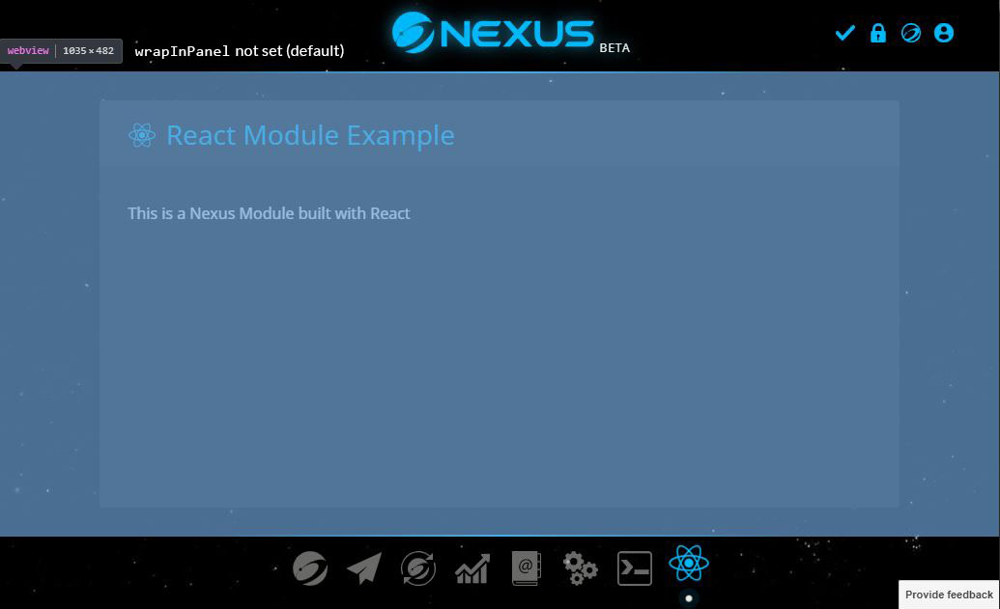
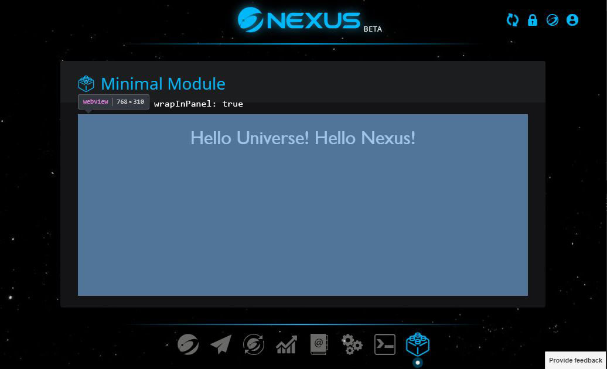

# Module types

Module type is defined by the `type` field in [nxs_package.json](./nxs_package.json.md). At the moment, there's only one module type that is supported which is `app` modules. Nexus team might consider adding support for more module types such as `theme` type in the future.

---

# `app` modules

`app` is the only Nexus Wallet Module type that's currently supported. Each `app` module has an icon in the navigation bar at the bottom of the wallet, when opened it takes up the main area of the wallet interface, similarly to how the built-in modules like Transactions or Settings do.

## WebView

Technically, when an `app` module is opened, all the module code and UI will be embedded to the wallet in a [`<webview>` tag](https://electronjs.org/docs/api/webview-tag). A `<webview>` tag works almost similarly to an `<iframe>` tag, but WebView runs in a separate process than the base wallet. WebView ensures that the module code execution environment is isolated from the base wallet for better security.

If you concern about WebView's security, see [WebView security](./module-security.md#webview-security).

> Note: you may have noticed, in [Electron's documentation on `<webview>`](https://electronjs.org/docs/api/webview-tag) there is a warning about `webview` tag's stability. However, the warning only addresses `<webview>`'s possible future changes in architecture and API, not security problems. This has already been [confirmed by Electron team](https://github.com/electron/electron/issues/18187). Architectural and API changes are not too big concerns for us because we control when and whether to update Electron version, and can decide to hold off the update until we can adapt to the changes. So, we can say that **it is safe to use `<webview>` tag**.

Since the module code is isolated inside a WebView, it needs some ways to communicate with the base wallet to do useful things, such as to receive wallet data, do RPC calls, or get the common styles and current theme from the base wallet so that the module UI blends well into the wallet UI around. [`NEXUS` global variable](./nexus-global-variable.md) exists for that reason. It is the bridge between your module and the base wallet, provides you with all the necessary libraries, utilities, common components, and methods for interacting with the base wallet. See [`NEXUS` global variable](./nexus-global-variable.md) for more details.

## HTML entry file

Just like a regular web page, WebView needs a HTML file as the entry to start loading all your module code. Javascript and CSS code can then be linked from the HTML entry file.

By default, Nexus Wallet will look for a file named `index.html` in your module's root directory to load and use as the entry file. You can also set a custom path to your entry file by setting the [`entry`](./nxs_package.json.md#entry) field in your [`nxs_package.json`](./nxs_package.json.md) file.

## `wrapInPanel` option

By default, module's WebView will take up the whole area between the header and the navigation bar of your wallet (see image below). If you want to wrap your module UI in a `Panel` component, you'll have to render the `Panel` component in your module code yourself. This way you'll have a greater control on your UI, you can display a custom title on your `Panel`, add some buttons to right side of the `Panel`'s header, or don't use `Panel` at all and customize it however you like.


_default webview area_

However, in case that you don't have those needs and just want to simplify your code, or you don't use React on your module (`Panel` is a React component), yet you still want your module UI to be wrapped in a `Panel`, in your [`nxs_package.json`](./nxs_package.json.md) file, you can set:

```js
{
  // ...
  "options": {
    // Add this under `options`
    "wrapInPanel": true
  }
}
```

With the `wrapInPanel` option set as `true`, your module's `webview` will be wrapped inside a `Panel`'s body (see image below). The `Panel`'s title will be automatically set as your module's `displayName` preceeded by your module's icon.


_webview area with wrapInPanel option on_
