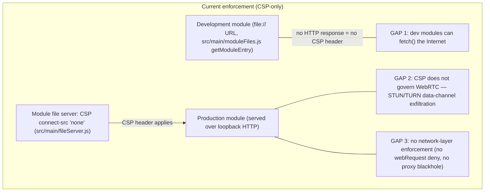
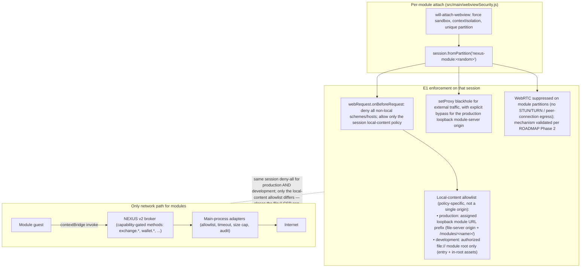

# Module egress enforcement — D3 = E3 policy, E1 mechanism

Decision context: [README §1 D3](../README.md#1-decision-record). Policy: modules never get direct Internet egress, even with capabilities (E3); all networking goes through the main-process broker. Mechanism: per-partition session-level deny-all (E1) so the guarantee is enforced at the network layer, not just by CSP headers.

## 1. Status quo (E2) and its gaps

Enforcement today is a CSP header (`connect-src 'none'`) set by the module file server (`src/main/fileServer.js`).

## 2. Target design (E1 mechanism enforcing E3 policy)

`src/main/webviewSecurity.js` already assigns each module webview a unique partition (`nexus-module:<random>`) in `will-attach-webview`, and resolves it to a `session` for policy bookkeeping. That session is the enforcement point.

## 3. Local-content allowlist (required for dev/prod parity)

E1 is **not** "allow only the module HTTP origin." A single-origin allowlist would break development modules, which load via `file://` from `getModuleEntry` (`src/main/moduleFiles.js`), not from the loopback file server. The session filter and blackhole must use a **policy-specific local-content allowlist**, matching the existing navigation policy shape in `isAllowedNavigation` (`src/main/webviewSecurity.js`):

| Loading mode | How entry is served | What E1 must allow | What E1 must still deny |
|---|---|---|---|
| **Production** | Loopback module file server (`getDomain()` + `/modules/<name>/…`) | Only that module's assigned **loopback module URL prefix** (file-server scheme/host/port + that module path prefix) | All other HTTP(S), WebSocket, `file://`, and non-local schemes/hosts |
| **Development** | `file://` URL for the authorized module entry under the resolved dev root | Only **`file://` URLs under that module's authorized root** (entry + same-root relative assets) | `file://` outside that root, all non-local HTTP(S)/WebSocket, and any other external schemes/hosts |

**Blackhole proxy:** `setProxy` on the module partition is defense in depth for anything that bypasses `webRequest`, but it must **bypass the production loopback module-server origin**. Without that bypass, the blackhole can interfere with legitimate production module asset loads. Development modules do not use the HTTP file server for entry/assets, so their local content is the authorized `file://` root above — not a proxy exception. All non-local HTTP(S), WebSocket, and other external requests remain denied in both modes.

## 4. Properties

| Property | How E1+E3 delivers it |
|---|---|
| Dev/prod parity | Enforcement keys off the session partition assigned at attach. Both modes get deny-all external egress; only the **local-content allowlist** differs (prod loopback module URL prefix vs authorized `file://` root), so the dev CSP gap closes without blocking dev entry files or in-root assets. |
| WebRTC exfiltration closed | Security objective: no STUN/TURN or peer-connection egress from module partitions. Treat the Electron control as a **mechanism-validation** item (per-session vs app-wide impact on the trusted renderer) — see [ROADMAP Phase 2](../ROADMAP.md#phase-2--egress-enforcement-e1). D3's objective is unchanged. |
| CSP demoted to defense-in-depth | The header stays on production file-server responses, but the security claim rests on the network layer (and applies to dev modules that never see that header). |
| Capability model stays honest | Capabilities grant broker methods only. There is no "egress capability" — a future allowlisted-egress idea would reuse the same session hook, but E3 says we don't. |
| Upstream story | Small, self-contained security PR; strengthens the exact "modules can't reach the Internet" claim the isolation stack advertises. See [ROADMAP Phase 2](../ROADMAP.md#phase-2--egress-enforcement-e1). |

## 5. Related fixes bundled with this work

- **B2:** one-shot `authorizedEntries.delete` at attach denies legitimate `<webview>` re-attach after DOM reparenting (Electron re-creates guest WebContents) — authorization must tolerate re-attach.
- **B3:** `pendingPoliciesBySession` entry leaks when `will-attach-webview` fires but the guest's `web-contents-created` never does.
