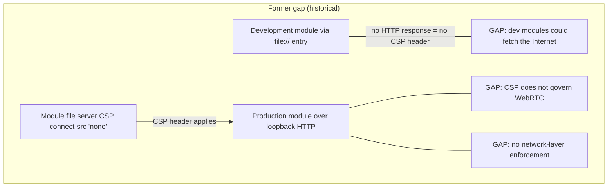
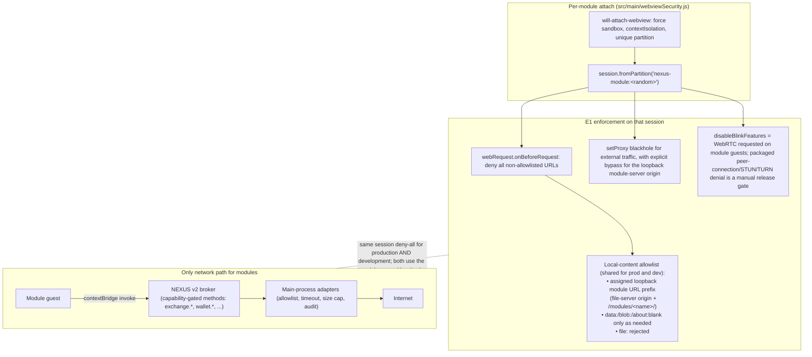

# Module egress enforcement — D3 = E3 policy, E1 mechanism

Decision context: [README §1 D3](../README.md#1-decision-record). Policy: modules never get direct Internet egress, even with capabilities (E3); all networking goes through the main-process broker. Mechanism: per-partition session-level deny-all (E1) so the guarantee is enforced at the network layer, not just by CSP headers.

## 1. Former status quo and why it changed

Earlier drafts described development modules loading via `file://` from
`getModuleEntry`, which skipped file-server CSP headers and forced a split
local-content allowlist. The implemented transport closed that gap:

- `getModuleEntry` always returns a module-scoped loopback file-server URL
- production and development guests share the same loopback-prefix allowlist
- `file:` navigation and requests are rejected by the network policy

## 2. Implemented design (E1 mechanism enforcing E3 policy)

`src/main/webviewSecurity.js` assigns each module webview a unique partition
(`nexus-module:<random>`) in `will-attach-webview`, and resolves it to a
`session` for policy bookkeeping. That session is the enforcement point.

## 3. Local-content allowlist (prod/dev parity via loopback)

E1 allows only the module's assigned loopback asset prefix. Development modules
no longer need a separate `file://` root policy because entry and assets are
served by the same constrained file server used in production.

| Loading mode | How entry is served | What E1 must allow | What E1 must still deny |
|---|---|---|---|
| **Production** | Loopback module file server (`getDomain()` + `/modules/<name>/…`) | Only that module's assigned **loopback module URL prefix** | All other HTTP(S), WebSocket, `file://`, and non-local schemes/hosts |
| **Development** | Same loopback module file server (`getModuleEntry` returns the loopback URL) | Only that module's assigned **loopback module URL prefix** | All other HTTP(S), WebSocket, `file://` (including former dev roots), and non-local schemes/hosts |

**Blackhole proxy:** `setProxy` on the module partition is defense in depth for
anything that bypasses `webRequest`, but it must **bypass the loopback
module-server origin**. Without that bypass, the blackhole can interfere with
legitimate module asset loads. All non-local HTTP(S), WebSocket, and other
external requests remain denied in both modes.

## 4. Properties

| Property | How E1+E3 delivers it |
|---|---|
| Dev/prod parity | Enforcement keys off the session partition assigned at attach. Both modes get deny-all external egress and the **same loopback module URL prefix** allowlist, so the former dev `file://` CSP gap is closed without a separate filesystem root policy. |
| WebRTC exfiltration | Security objective: no STUN/TURN or peer-connection egress from module partitions. `disableBlinkFeatures = 'WebRTC'` is requested on guests; packaged-Electron denial remains a **manual release gate** (not automated coverage). See [ROADMAP Phase 2](../ROADMAP.md#phase-2--egress-enforcement-e1). |
| CSP demoted to defense-in-depth | The header stays on file-server responses for both production and development loads, but the security claim rests on the network layer. |
| Capability model stays honest | Capabilities grant broker methods only. There is no "egress capability" — a future allowlisted-egress idea would reuse the same session hook, but E3 says we don't. |
| Upstream story | Small, self-contained security PR; strengthens the exact "modules can't reach the Internet" claim the isolation stack advertises. See [ROADMAP Phase 2](../ROADMAP.md#phase-2--egress-enforcement-e1). |

## 5. Related fixes bundled with this work

- **B2:** one-shot `authorizedEntries.delete` at attach denies legitimate `<webview>` re-attach after DOM reparenting (Electron re-creates guest WebContents) — authorization must tolerate re-attach.
- **B3:** `pendingPoliciesBySession` entry leaks when `will-attach-webview` fires but the guest's `web-contents-created` never does.

## 6. Related security diagrams

- [Module loopback transport](../../security/Diagrams/module-loopback-transport.md)
- [Module network policy](../../security/Diagrams/module-network-policy.md)
