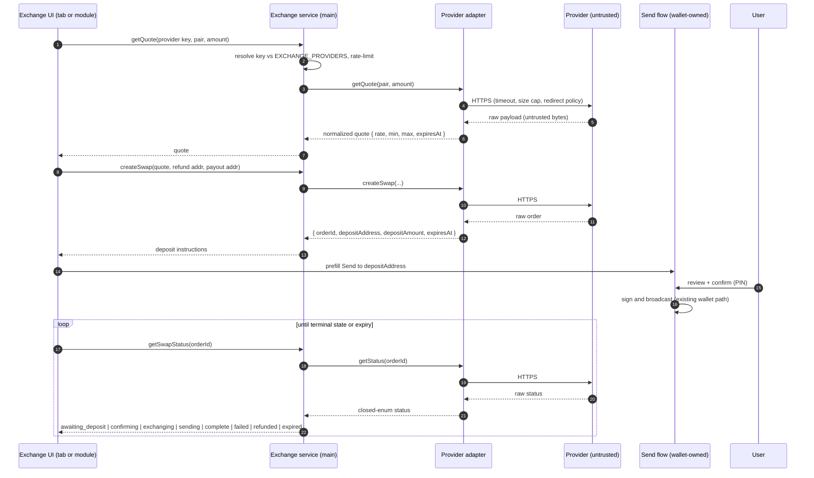
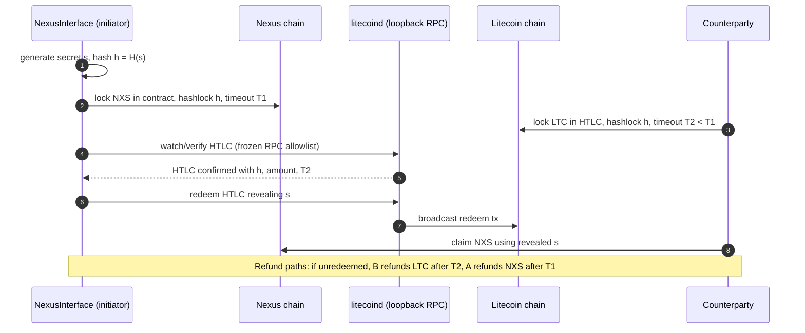

# Exchange sequences — quote → deposit → swap → settle

Decision context: [README §1 D1/D2](../README.md#1-decision-record), [README §5 provider-adapter contract](../README.md#5-provider-adapter-contract).

## 1. Provider-brokered swap (interim adapter, phase 1 tab / phase 2 module)

The ShapeShift model reborn — but provider-agnostic, main-process-only, and with funds moving exclusively through the wallet's own Send flow.

Invariants: the broker registers intent and reports status only; deposit addresses are shown for explicit user confirmation; a provider change touches the adapter, never the flow.

## 2. Atomic swap end-state (research track, HTLC/adaptor)

Trustless NXS↔LTC settlement. Requires litecoind wallet RPC for the LTC-side HTLC and Nexus contract-side design. The wallet never imports `wallet.dat` — LTC keys stay in LTC Core, driven over authenticated loopback RPC.

Phasing: this sequence lands only after D2 = 1(a) connectivity (PR #36 resurrection) is stable — see [ROADMAP Phase 6](../ROADMAP.md#phase-6--atomic-swap-research-track-d2-end-state).
