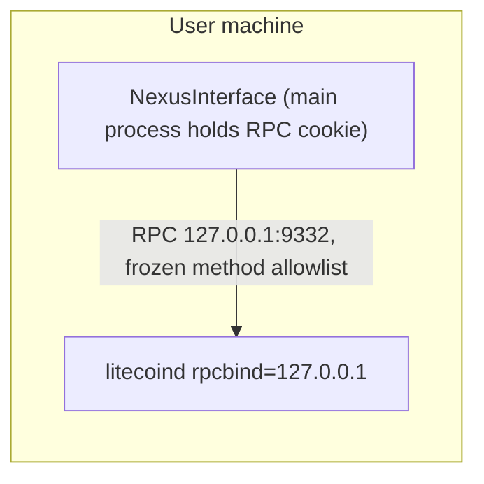
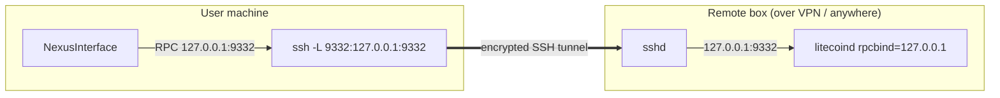
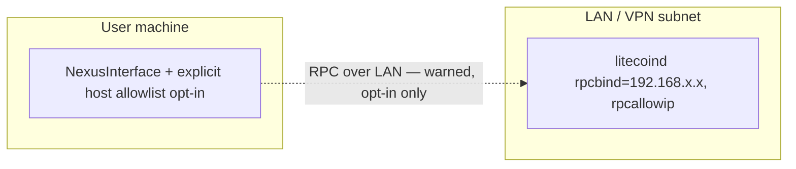
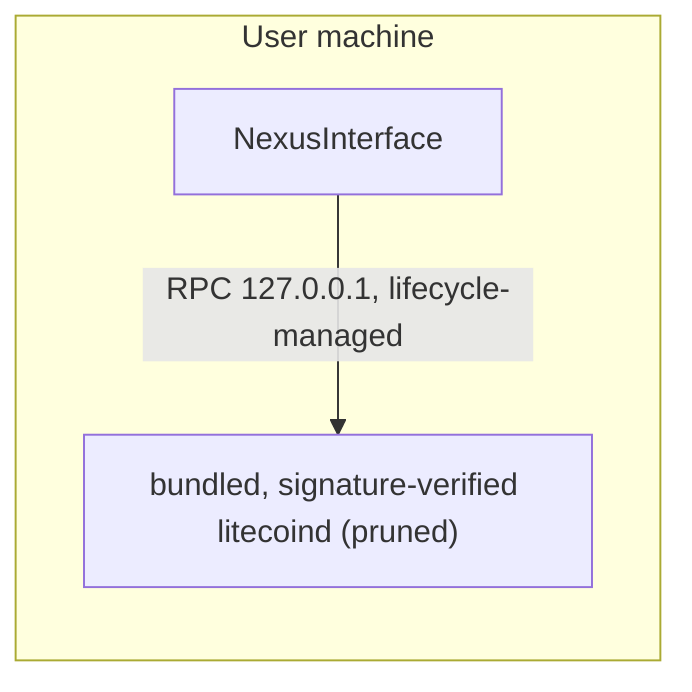

# LTC connectivity topologies

Decision context: [README §1 D2 = 1(a)](../README.md#1-decision-record) — user-managed litecoind, loopback-only host policy, PR #36 resurrected after B1.

The wallet **only ever dials loopback** (`127.0.0.1`/`::1`). Remote and VPN topologies are reached by forwarding a loopback port, not by widening the host policy.

## 1. Accepted default — same-machine litecoind (loopback)



## 2. Accepted for VPN/remote — SSH local forward (zero policy change)

Works with any VPN topology; the wallet still sees only loopback.

```bash
ssh -N -L 9332:127.0.0.1:9332 user@litecoind-host
```



Kill-switch note: if a VPN kill-switch drops the tunnel, the wallet degrades to the existing "unreachable" state — stale data is never presented as connected (PR #36 invariant).

## 3. Fallback only — explicit opt-in RFC1918/host allowlist (option 1b)

Not shipped by default. Requires explicit user opt-in, strong warnings (credentials traverse the LAN), and remains off the upstream path unless SSH forwarding proves unworkable.



## 4. End-state idea — bundled litecoind (option 2, not the start)

Ship/verify LTC Core (≥ 0.21.5.6) alongside the bundled Nexus Core, pruned mode. Deferred: supply-chain and updater burden; revisit only after the monitor + exchange phases are stable.



## Invariants (all topologies)

1. RPC cookie/credentials live in the main process only.
2. Frozen RPC method allowlist — monitoring first; wallet-write methods added only by the atomic-swap track with their own review.
3. Stale ≠ connected: freshness is explicit in UI state.
4. Host policy in code stays loopback-only; topology flexibility comes from tunneling, not policy widening.
