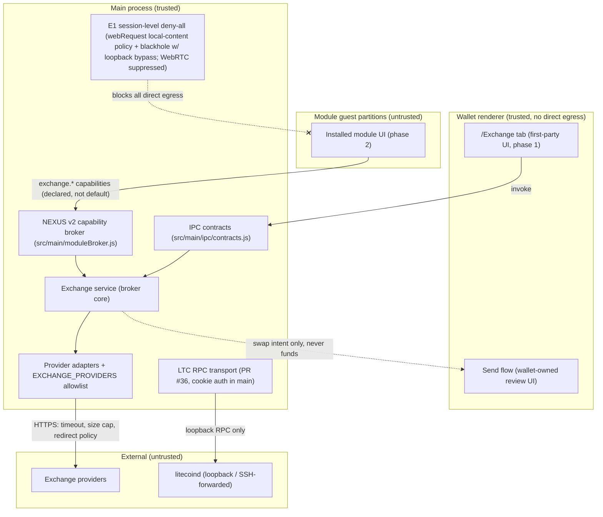

# Trust-boundary map — tab path vs module path

Decision context: [README §1 D1 = H (hybrid)](../README.md#1-decision-record), [README §3 threat model](../README.md#3-threat-model).

Both frontends terminate in the **same** main-process exchange broker. The built-in tab (phase 1) adds no new trust domain; the module path (phase 2) is gated on capabilities *and* on E1 network-layer enforcement.

Boundary rules:

1. Funds cross **only** the renderer Send flow with explicit user confirmation; the broker never signs or broadcasts.
2. Neither renderer nor modules ever supply URLs — only opaque provider keys resolved in main.
3. Module guests have **zero** direct network access under D3 (E3 policy, E1 enforcement) — the `exchange.*` capabilities grant broker methods, not egress.
4. litecoind RPC credentials (cookie) never leave the main process.
