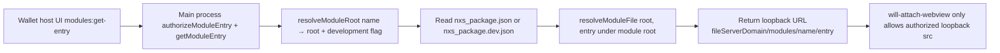
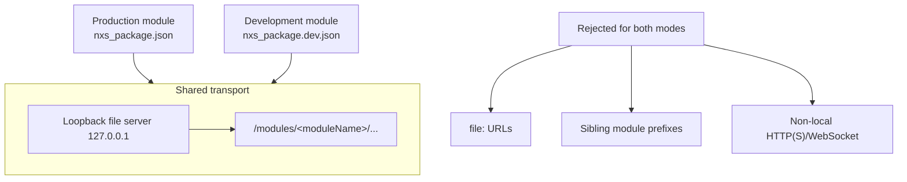

# Module loopback transport

Both production and development module WebViews load through the private
loopback module file server. There is no authorized `file:` guest root in the
implemented transport.

## Entry resolution

Key sources:

- `src/main/moduleFiles.js` `getModuleEntry` always returns
  `` `${fileServerDomain}/modules/${name}/${entry}` ``
- `src/main/webviewSecurity.js` `moduleUrlPrefix` and `isAllowedNavigation`
  require the same prefix
- `src/main/fileServer.js` binds the private asset server to `127.0.0.1`

## Production vs development

Development still resolves files from the developer-selected module root on
disk, but the **guest document URL** and **network allowlist** are the loopback
prefix, not a `file:` root. That keeps CSP headers, path allowlisting, and
session policy aligned with production.
