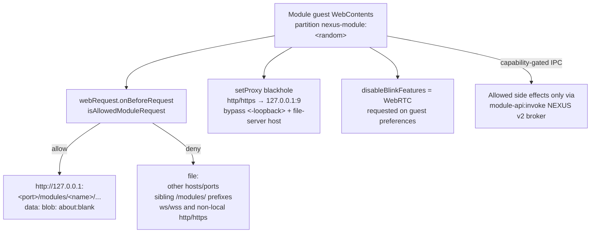
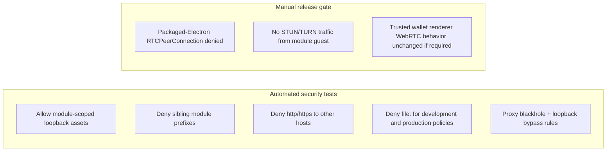

# Module network policy

Per-module session partitions enforce deny-by-default networking for production
and development guests.

## Enforcement stack

Implementation:

- `src/main/ipc/moduleNetworkPolicy.js`
- `src/main/webviewSecurity.js` session wiring
- Automated coverage: `test/security/module-network-policy.test.js`

## Automated tests vs manual gate

Do **not** document WebRTC/STUN/TURN denial as automated coverage. The guest
preference requests WebRTC disabling, but packaged peer-connection behavior is
validated on release builds.
