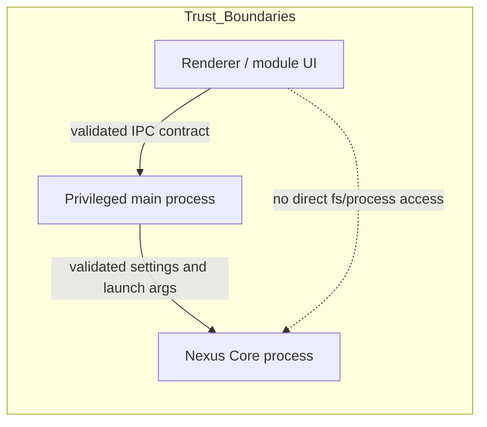
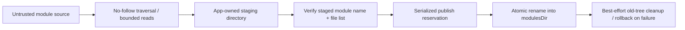
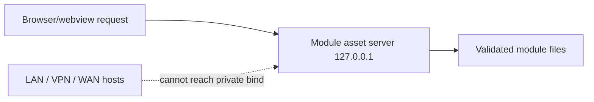
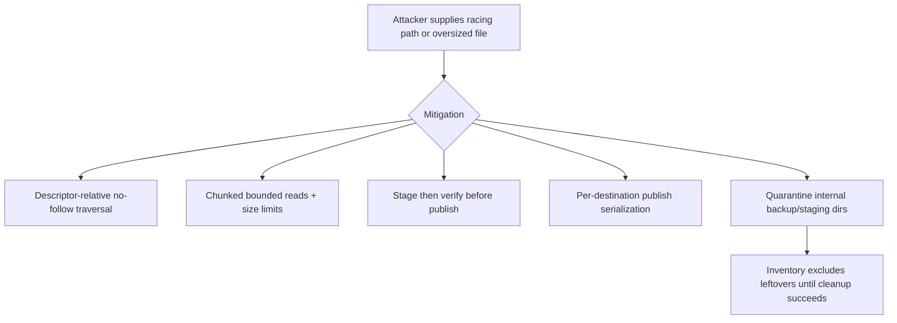

# PR #42 Security Changelog

**PR:** #42 — `Fix PR #277 review items and security merge-readiness gaps`  
**Merge date:** August 9, 2026  
**Follow-up scope:** Post-merge hardening for module installation concurrency, internal-directory cleanup, bounded reads, regression tests, and release documentation.

## Threat actors and trust boundaries

- **Renderer content and third-party modules:** untrusted inputs that must not gain direct filesystem, process, or network privilege.
- **User-selected module sources:** untrusted directories or archives that may contain malformed paths, symlinks, oversized files, or racing filesystem changes.
- **Privileged Electron main process:** trusted enforcement point for validation, installation, file serving, and Core launch restrictions.
- **Nexus Core:** separate trust boundary behind validated IPC and bounded host-process control.
- **Local network peers:** untrusted by default; the private module asset server is restricted to loopback rather than LAN/VPN/WAN exposure.

## Protected assets

- Wallet data and module install roots under the application data directory.
- Nexus Core launch parameters and settings-derived process configuration.
- Module HTML entry files, icons, and package metadata.
- Renderer-to-main privilege boundary and module-serving network boundary.
- Main-process memory and file-descriptor budget during module inspection and install.

## Security work merged in PR #42

### Core argument and settings validation

- Main-process IPC contracts validate settings and operation payloads before privileged actions run.
- Sensitive Core launch settings stay constrained to approved fields and validated value shapes.
- Renderer code no longer receives broad privileged filesystem/process reach-through for module management.

### Host-platform path validation and Windows UNC/device-path policy

- Module paths are normalized and kept relative to approved roots.
- Installed-module file resolution rejects escaping paths and unsafe roots.
- Windows mutable-directory installs fail closed when descriptor-relative/no-follow traversal is unavailable; archive-based install remains supported.
- UNC/device-path style bypasses remain disallowed by the root-confinement and no-follow checks rather than being trusted as platform-normalized inputs.

### Loopback-only module file server

- The module asset server binds to `127.0.0.1`, not to general network interfaces.
- This narrows exposure to the local machine and prevents third parties on LAN/VPN/WAN networks from requesting private module assets.

### Module root, entry, and icon containment

- Module entry and icon paths must remain relative and within the module root.
- Production module roots are confined beneath `modulesDir`.
- Icon and module-file loads reject symlinks and realpath escapes.

### Immutable icon-byte delivery

- Icon bytes are read in the main process from validated files and sent as inert data, rather than exposing arbitrary file paths to renderer consumers.

### Intermediate-directory symlink/junction TOCTOU defenses

- Module installs use descriptor-relative opens with `O_NOFOLLOW` where the host supports them.
- Intermediate path components are checked so a symlink/junction swap cannot redirect a later file open outside the intended module tree.
- Mutable directory installs on platforms without that protection fail closed instead of accepting a junction-racy fallback.

### POSIX descriptor-relative traversal and Windows fail-closed ZIP fallback

- POSIX-like hosts use descriptor-relative traversal for mutable directory installs.
- Windows and other unsupported hosts reject mutable directory installs and continue to support archive-based installs extracted into an app-owned trusted directory.

### Bounded reads and resource limits

- Regular-file reads stay bounded by configured size limits.
- The follow-up PR replaces eager `maxBytes + 1` allocation with a single verified-size buffer (plus a one-byte growth probe) or incremental chunk-bounded growth when size is unavailable, avoiding a retained chunk list plus `Buffer.concat` duplicate.
- Archive extraction retains entry-count, size, expanded-size, and compression-ratio limits.

### Staged, verified, atomic module publication and rollback

- Module installs copy into an app-owned staging directory first.
- Staging is re-verified before final publication.
- Publication uses rename-based replacement with rollback to the previous module if the final swap fails.
- The follow-up PR serializes same-destination publication and enforces overwrite policy at publish time.

### Dependency update and Electron role fixes

- `electron-updater` remains pinned to the remediated version/lockfile combination validated by security tests.
- Electron fullscreen menu role handling uses the accepted lowercase role name and matching sanitizer allowlist entry.

### Test and CodeQL validation

- Security regressions are covered by behavioral `node:test` cases in `test/security/module-path-safety.test.js`.
- The follow-up adds concurrency, cleanup-quarantine, and bounded-read regression coverage.
- Final validation for this follow-up PR includes the security test suite, repository build, automated code review, and CodeQL scanning.

## Follow-up PR: residual risks addressed after merge

### 1. Same-destination install publication is now serialized

Before the follow-up, two concurrent `overwrite: false` installs targeting the same module name could both pass an early existence check before publication. The follow-up:

- serializes publication work per destination/module directory,
- checks `overwrite` at publish time while the reservation is held,
- returns `ALREADY_EXISTS` if the destination exists at publication time and overwrite was not approved,
- preserves parallelism for installs targeting different module names, and
- releases the reservation on success, validation failure, copy failure, rename failure, and exceptions.

### 2. Internal install directories are quarantined, excluded, and retried safely

Before the follow-up, `.replaced-*` cleanup failures were swallowed and internal directories could be reconsidered as modules. The follow-up:

- defines shared internal-directory naming rules for `.installing-*` and `.replaced-*`,
- excludes those directories from module inventory and failed-module reporting,
- logs cleanup failures with path/error context suitable for diagnosis,
- retries cleanup during later inventory scans,
- refuses cleanup outside `modulesDir`, and
- preserves the new live module even if stale backup cleanup fails after successful publication.

### 3. Bounded reads now allocate incrementally

Before the follow-up, a tiny file could still allocate a full `maxBytes + 1` buffer. The follow-up:

- reads from the open handle in fixed-size chunks,
- accumulates only bytes actually read,
- stops after `maxBytes + 1` bytes,
- still rejects over-limit reads, including growth between stat and read, and
- preserves handle-relative/no-follow and cleanup guarantees around the caller paths that use it.

## Residual risks

- Mutable directory installs still fail closed on Windows because there is no equivalent descriptor-relative/no-follow traversal path in this implementation.
- Cleanup of locked stale internal directories may require a later retry, especially on Windows, but the directories remain quarantined and excluded from inventory until removal succeeds.
- Archive extraction and module verification remain bounded and validated, but users can still choose malicious module sources; the trust model is containment and validation, not source trust.

## Mermaid diagrams

### 1. Renderer → validated IPC → privileged main process → Nexus Core

### 2. Untrusted module source → no-follow traversal → staging → verification → atomic publish

### 3. Loopback module server network boundary

### 4. Threat / mitigation summary

